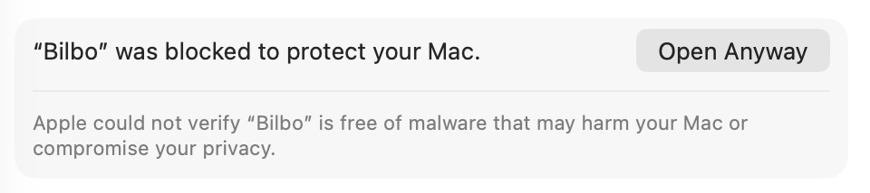

I know, everyone and their mothers have made text capture and note apps. But the current code generation abundance has made it much easier to make my own than browse through the many that exist.

This one is called **Bilbo**. I've been using it localy for a while, and I've really been enjoying it. You can download it [here](https://github.com/effieklimi/Bilbo/releases/latest) for macOS (Apple Silicon and Intel, macOS 13.3 or later).

It's a very minimalistic, lightweight macOS app that offers:

- **Daily notes.** Write in a Markdown editor with headings, lists, quotes, code
  blocks, and editable tables. Changes save automatically.
- **Quick captures.** Press `⌥C` while Bilbo is running to capture selected text
  from another app. Add a thought, then save it with `⌘Enter`. Source details are
  included when the app you're capturing from makes them available.
- **Captures inside notes.** Insert a saved capture with its quote, your comment,
  and its source link. The capture archive also shows which notes use it.
- **Search and tags.** Use `⌘K` to find notes and captures. Type `#` to browse tags,
  or click a tag to search for it.
- **A few preferences.** Light and dark themes, custom keyboard shortcuts,
  interface sizing, and optional launch at login.

### To install:

1. [Click here to download Bilbo](https://github.com/effieklimi/Bilbo/releases/download/v0.1.2/Bilbo_0.1.2_universal.dmg), or visit the [release page](https://github.com/effieklimi/Bilbo/releases/latest) and download the `.dmg` file.
2. Once downloaded, open the `.dmg` file and drag Bilbo into Applications.
3. Open Bilbo from Applications. The current release isn't notarized by Apple yet, so macOS may show a warning that Apple could not verify Bilbo is free of malware.
4. Dismiss the warning, then open **System Settings → Privacy & Security**. Scroll down to **Security** and click **Open Anyway** next to Bilbo, as shown below. Confirm **Open** when prompted. [Apple’s instructions](https://support.apple.com/en-us/102445).

   

5. Pick your diary folder. Give Accessibility access if you want to capture selected text from other apps.

Bilbo checks for updates once an hour while running and lets you choose when to install them. Accessibility access may need to be enabled again after an update.

Hope you enjoy. [Contact me](mailto:effie@effie.bio) if you have any opinions about it.
